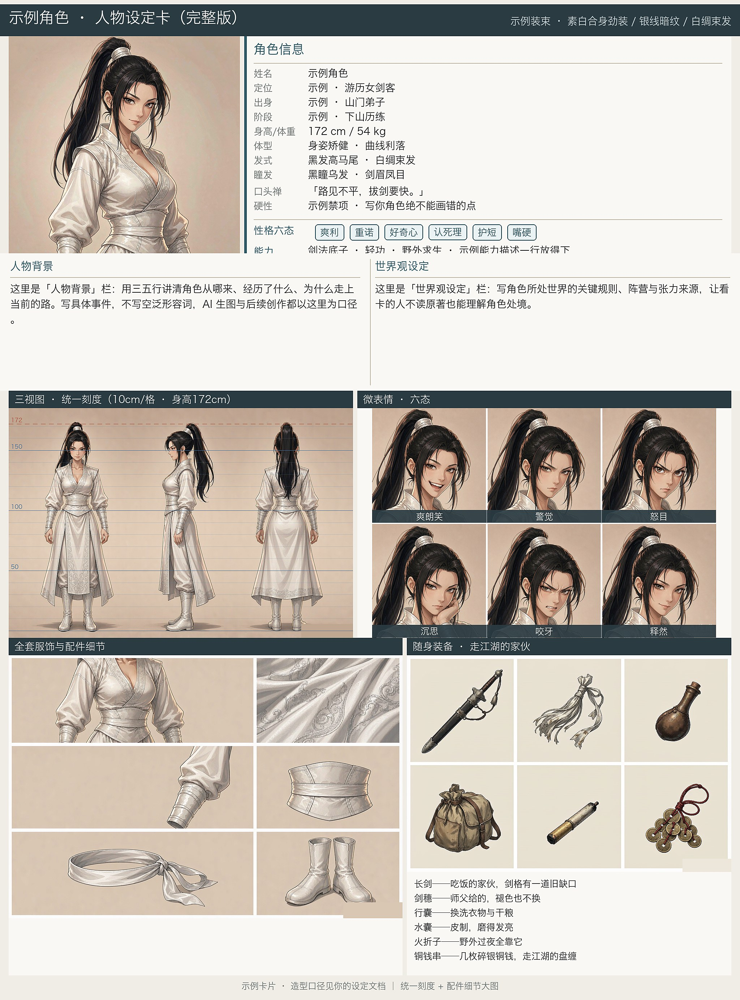
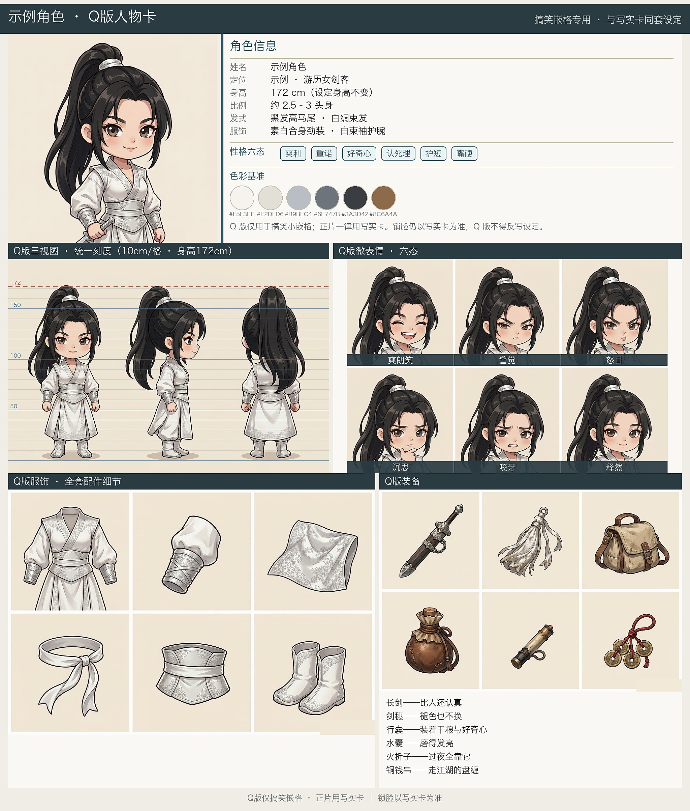

# Character Card Kit · AI 人物卡生成器

**English**: A open-source toolkit that turns a character description into two professional character reference sheets (a realistic full card + a chibi card) with AI image generation + Python assembly. Chinese UI; works with any AI assistant that can generate images.

---

给 AI 一段人物描述，产出两张可以直接用于 AI 出片/漫画/动画生产的**人物设定卡**：

- **写实完整卡**：主肖像 + 角色信息栏 + 人物背景/世界观 + **统一刻度三视图**（自动检测头顶/脚线，10cm 细线 / 50cm 粗线 / 身高虚线）+ 六态微表情 + 服饰六格 + 装备六格（带注记）+ 六色基准色板
- **Q 版人物卡**：同套设定的 Q 版独立卡（搞笑嵌格/周边用，不与写实混排）

整套卡的核心价值：**给后续 AI 生图当锁脸参考**。有了统一刻度、逐格名牌和色板，角色在几十个镜头、几百次重新生成里才不会崩脸、崩服装、崩比例。

## 产出效果

下面两张是**真实生成的示例卡**（示例角色「白衣女剑客」，10 张 AI 分件 + 本工具组装）：

<p align="center">
  
</p>
<p align="center">
  
</p>

卡片结构（2048 宽，从上到下）：

Q 版卡结构相同，全部板块 Q 版化。

## 快速开始

### 0. 安装依赖

```bash
pip install -r requirements.txt        # Pillow + numpy
```

要求 Python ≥ 3.10。中文字体自动探测（macOS 冬青黑/苹方、Windows 雅黑、Linux Noto/文泉驿），也可用环境变量 `CARD_FONT=/path/to/字体.ttf` 强制指定。

### 1. 生成 10 张分件源图（AI 生图）

把 [SKILL.md](SKILL.md) 喂给你的 AI 助手（WorkBuddy / Claude / 任何能调生图工具的 Agent），说"给角色 X 做人物卡"。它会按提示词模板生成：

| # | 写实分件 | 尺寸 | # | Q 版分件 | 尺寸 |
|---|---------|------|---|---------|------|
| 1 | 主肖像 | 1024×1024 | 6 | Q版主肖像 | 1024×1024 |
| 2 | 三视图（正/侧/背） | **1536×1024 横版** | 7 | Q版三视图 | 1536×1024 |
| 3 | 微表情六格 | **1536×1024 横版 3×2** | 8 | Q版微表情 | 1536×1024 |
| 4 | 服饰图鉴六格 | 1536×1024 | 9 | Q版服饰图鉴 | 1536×1024 |
| 5 | 装备图鉴六格 | 1536×1024 | 10 | Q版装备图鉴 | 1536×1024 |

**硬约束**（违反必返工）：
- 微表情六格必须**横版 3 列×2 行**，方图会导致名牌错位（服饰/装备六格不叠名牌，不受影响，但仍建议 3×2）；
- 底色统一浅色 ≈ `(240, 237, 231)`，否则组装后色带不齐；
- 三组六格**一律素面，禁画任何文字标签**——服饰/装备的说明文字由资料栏注记承担，不在图上标；
- 六格图里的右下水印选好修补策略（见下文配置项）。

也可以自己用任何生图工具手搓这 10 张图，只要尺寸和底色对得上。

### 2. 写角色配置

```bash
cp characters.example.py characters.py
# 编辑 characters.py：填入角色的资料、六格名牌名单、色板、身高…
```

所有字段说明直接看 `characters.example.py` 里的注释，每个字段都有示例。

### 3. 体检 + 组装

```bash
python check_assets.py                  # 可选：提前发现缺图/字段错误
python compose_full_card.py 示例角色     # 产出写实完整卡
python compose_q_card.py   示例角色     # 产出 Q 版卡
```

成品 PNG 默认写到配置里的 `out` 路径；带刻度线和名牌的分件中间产物会落回分件目录，可复用。

## 作为 AI 助手 Skill 安装

`SKILL.md` 是标准的 agent skill 格式，兼容 WorkBuddy / Claude Code 等支持 SKILL.md 的助手：

1. 把本仓库（或仅 `SKILL.md` + 本 README）放进助手的 skills 目录；
2. 对助手说："**给角色 X 做一张人物卡**，设定如下：……"；
3. 助手会自动走完：考据 → 10 分件生图 → 写配置 → 组装 → 目检 全流程。

## 配置字段速查

| 字段 | 必填 | 说明 |
|------|:---:|------|
| `parts` | ✓ | 分件源图目录 |
| `out` | ✓ | 成品卡输出路径 |
| `bust/turn/expr/acc/eq` | ✓ | 五张分件文件名 |
| `title` / `subtitle` | ✓ | 卡片标题条文案 |
| `info_pairs` | ✓ | 资料栏键值对（姓名/定位/身高…） |
| `info_full` | 写实 | 资料栏整行条目（口头禅/硬性禁项…） |
| `traits` | ✓ | 性格六态（6 个词） |
| `ability` | 写实 | 能力描述（自动换行） |
| `background` / `world` | 写实 | 人物背景 / 世界观段落 |
| `palette` | ✓ | 6 色 `[("#HEX", (r,g,b)), …]` |
| `eq_names` | — | 装备名单（可选，仅作配置记录，不叠印到卡上） |
| `expr_names` | ✓ | 微表情六格名牌（6 个词；**只有这一组会叠名牌**） |
| `eq_notes` | ✓ | 装备逐条注记（服饰/装备的说明都靠这里，不在图上标） |
| `cm_height` | ✓ | 设定身高 cm（刻度线按此生成；Q 版非人形也适用，如 20） |
| `turn_front_x` | Q版必填 | 三视图里**正面视图**的 x 像素区间，如 `(1060, 1500)` |
| `expr_grid` / `acc_grid` | 可选 | 网格布局，默认 `(3, 2)` |
| `turn_wm` | 可选 | 三视图水印修补：`corner`（默认）/ `copy` / `stretch` |
| `turn_patch_span` | 可选 | `stretch` 模式取样区间，如 `(0.315, 0.4167)` |
| `bust_wm` | 可选 | 主肖像水印：`crop`（默认，裁掉底部 6.2%）/ `copy` |
| `acc_label` / `eq_label` | 可选 | 板块标题自定义（非人形角色可改成"外形细节"等） |
| `prefix` | 可选 | 中间产物文件名前缀，默认用角色名 |
| `foot` | 可选 | 底注条文案 |

## 常见坑（实测踩出来的）

| 坑 | 症状 | 解法 |
|----|------|------|
| 微表情源图出成方图 | 微表情名牌与格子错位 | 重出**横版 3×2 (1536×1024)**，名牌带间距 = 半行高才对齐（服饰/装备不叠名牌，不受影响） |
| 三视图水印补丁露色块 | `corner` 填充在地面渐变上出色块 | `turn_wm="stretch"`，取人物间地面空隙拉伸贴盖 |
| `copy` 补丁带进杂物 | 侧面视图串元素 | 同上，改 `stretch` |
| 刻度线整体漂移 | 身高线/脚线对不上 | 源图背景色不均匀，确保 `detect_figure_span` 走四角自动采样（默认已开启） |
| 挂图超限 | 高清分件 5–8MB 报生图请求体超限 | 先缩到 1200px 高质量 JPG（约 300KB）再当锁脸参考挂 |
| 撞脸/串设定 | 多角色互相污染 | 每个角色独立目录 + 独立锁脸参考；Q 版锁脸挂写实卡，别挂别人的分件 |

## 目录结构

```
character-card-kit/
├── cardlib.py              # 共享绘图库（字体/水印/刻度/名牌/配置加载）
├── compose_full_card.py    # 写实完整卡组装
├── compose_q_card.py       # Q 版卡组装
├── check_assets.py         # 配置与资产体检
├── characters.example.py   # 角色配置示例（复制为 characters.py 使用）
├── SKILL.md                # AI 助手 skill（生图提示词模板 + 全流程）
├── requirements.txt
└── LICENSE
```

## License

MIT。用这套流程做的角色卡归你，随便用。
